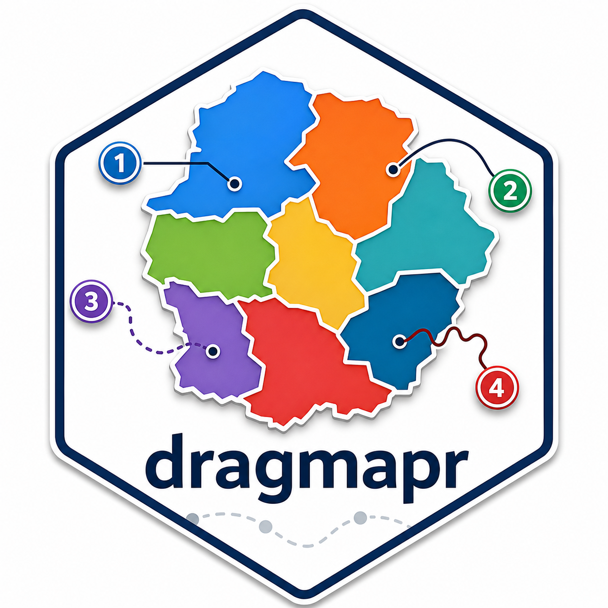

# dragmapr 

[](https://github.com/PrigasG/dragmapr/actions/workflows/R-CMD-check.yaml)

`dragmapr` lets you move map regions and labels by hand, then save the edited
layout as reproducible data.

Use it when you want to:

- fix a map layout manually after automatic placement
- drag labels independently from regions
- save offsets and recreate the same map later
- connect an editor to `explodemap`, Shiny, or a static `ggplot2` export

## Install

```r
install.packages("dragmapr")

# Development version
# install.packages("pak")
# pak::pak("PrigasG/dragmapr")
```

## Try It

- Live Spatial Studio: <https://Prigas89-dragmapr-spatial-studio.hf.space>
- Package site: <https://prigasg.github.io/dragmapr/>
- Cross-package roadmap: [ROADMAP.md](ROADMAP.md)
- Pipeline Studio:

```r
shiny::runApp(system.file("shiny/pipeline-studio", package = "dragmapr"))
```

Pipeline Studio is the bridge app for `explodemap` and `dragmapr`: compute a
layout, refine it by dragging, apply the edits, and export the final map.

## Quick Start

```r
library(dragmapr)

my_sf <- prepare_dragmapr_sf(my_sf)

drag_map_prototype(
  my_sf,
  region_col = "region",
  open = TRUE
)
```

After dragging, download the offset CSVs and rebuild the map:

```r
render_dragged_map(
  my_sf,
  region_col = "region",
  region_offsets = "drag_region_offsets.csv",
  label_offsets = "drag_label_offsets.csv",
  file = "map.png"
)
```

## State-First Workflow

For new work, prefer a `dragmapr_state`. It keeps the computed geometry separate
from your editorial choices.

```r
library(explodemap)
library(dragmapr)

layout <- explode_grouped(my_sf, region_col = "region", plot = FALSE)
state <- as_dragmapr_state(layout)

dragmapr_edit(layout, state = state)
```

Use the same state for interactive and static output:

```r
focus_map(layout, state = state)

render_dragged_map(
  layout$sf_grouped,
  region_col = "region",
  state = state,
  file = "map.png"
)
```

Save and restore the state:

```r
write_dragmapr_state(state, "composition.json")
state <- read_dragmapr_state("composition.json")
```

## Shiny

```r
ui <- fluidPage(
  dragmaprOutput("map", height = "650px")
)

server <- function(input, output, session) {
  output$map <- renderDragmapr({
    dragmapr_widget(
      my_sf,
      region_col = "region",
      region_palette = c(North = "#4C78A8", South = "#54A24B")
    )
  })

  observeEvent(input$map_state, {
    state <- dragmapr_widget_state(input$map_state)
  })
}
```

Update display options without rebuilding the widget:

```r
updateDragmapr(session, "map", selected_feature = "North")
updateDragmapr(session, "map", region_palette = palette)
```

## Compare States

Release A adds small state helpers for apps and tests:

```r
diff <- dragmapr_state_diff(draft, canonical, tolerance = 1)

diff$changed
diff$changed_regions
diff$changed_labels

dragmapr_state_equal(draft, canonical, compare = "composition")
summary(draft)
```

Use `compare = "composition"` when selection or viewport changes should not
count as dirty edits.

## Labels And Notes

Labels are optional:

```r
dragmapr_widget(my_sf, region_col = "region", labels = FALSE)
```

Create one label per region:

```r
labels <- make_region_labels(my_sf, region_col = "region", label_col = "name")
```

Create callout boxes:

```r
notes <- as_drag_annotations(
  data.frame(
    label_id = "note-1",
    region = "North",
    label = "Important note",
    x = 50000,
    y = 150000
  ),
  connector = TRUE,
  connector_type = "curve"
)
```

## Project Bundles

Spatial Studio can export a project ZIP. Recreate the static map from the ZIP:

```r
render_dragmapr_project(
  "dragmapr-project.zip",
  file = "final-map.png",
  width = 10,
  height = 8,
  dpi = 300
)
```

## Built-In Examples

```r
source(system.file("examples/basic_draggable_map.R", package = "dragmapr"))
source(system.file("examples/full_state_roundtrip.R", package = "dragmapr"))
source(system.file("examples/explodemap_dragmapr_pipeline.R", package = "dragmapr"))
```

For the full app:

```r
shiny::runApp(system.file("examples/shiny_spatial_studio.R", package = "dragmapr"))
```

## Notes

- Use projected polygon data. Run `prepare_dragmapr_sf()` for longitude/latitude data.
- Dragged layouts are for display and communication, not geographic analysis.
- Large datasets should be simplified or grouped before editing in the browser.
- Offset CSV workflows still work; `dragmapr_state` is the recommended path for new apps.
