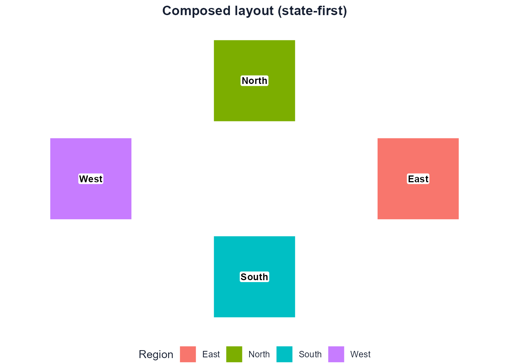

# State-first workflow

The recommended way to use dragmapr is to treat a layout as an editable
**composition object** – a `dragmapr_state` – and carry it through three
steps:

    compute  ->  compose  ->  render
    (layout)     (edit)       (static / interactive)

The state is plain, reproducible data: region and label offsets (as
metre deltas), the projected `crs`, a `geometry_id`, the
`selected_feature`, and a monotonically increasing `version`. Because
the geometry and the editorial state are kept separate, you can
recompute the layout while preserving manual edits, and the *same* state
object drives the interactive editor, the static renderer, and any
persistence.

The older route – exporting offset CSVs and calling
[`as_dragmapr()`](https://prigasg.github.io/explodemap/reference/as_dragmapr.html)
– still works, but it is now the low-level escape hatch rather than the
main road.

## 1. Compute

In a full pipeline the layout comes from explodemap, which computes a
mathematically valid exploded layout and hands it over as a state:

``` r

library(explodemap)

layout <- explode_grouped(my_sf, region_col = "region")
state  <- as_dragmapr_state(layout)   # dx_m/dy_m deltas + crs + geometry_id
```

For a self-contained example we build the equivalent state directly, so
this vignette runs with only dragmapr installed:

``` r

library(dragmapr)

make_square <- function(x0, y0, size = 100000) {
  sf::st_polygon(list(rbind(
    c(x0, y0), c(x0 + size, y0), c(x0 + size, y0 + size),
    c(x0, y0 + size), c(x0, y0)
  )))
}

regions <- sf::st_sf(
  region = c("North", "South", "East", "West"),
  geometry = sf::st_sfc(
    make_square(0, 140000), make_square(0, 0),
    make_square(140000, 70000), make_square(-140000, 70000),
    crs = 3857
  )
)

state <- dragmapr_state(
  region_offsets = data.frame(
    region = c("North", "South", "East", "West"),
    dx_m   = c(0, 0, 60000, -60000),
    dy_m   = c(50000, -50000, 0, 0)
  ),
  crs = 3857,
  geometry_id = "synthetic-quad-v1"
)
state
#> $level
#> [1] "region"
#> 
#> $region_offsets
#>   region   dx_m   dy_m
#> 1  North      0  50000
#> 2  South      0 -50000
#> 3   East  60000      0
#> 4   West -60000      0
#> 
#> $label_offsets
#> [1] label_id region   dx_m     dy_m    
#> <0 rows> (or 0-length row.names)
#> 
#> $expanded_groups
#> character(0)
#> 
#> $view
#> NULL
#> 
#> $version
#> [1] 0
#> 
#> $crs
#> [1] 3857
#> 
#> $geometry_id
#> [1] "synthetic-quad-v1"
#> 
#> $selected_feature
#> NULL
#> 
#> attr(,"class")
#> [1] "dragmapr_state"
```

## 2. Compose

[`dragmapr_edit()`](https://prigasg.github.io/dragmapr/reference/dragmapr_edit.md)
is the friendly front door to the interactive editor. It accepts a
projected `sf`, an explodemap `grouped_exploded_map`, or a
`dragmapr_layout`, seeded with the state:

``` r

dragmapr_edit(regions, region_col = "region", state = state)
```

Inside Shiny, the widget reports every edit through an input named
`paste0(outputId, "_state")`. Rebuild a `dragmapr_state` from it with
[`dragmapr_widget_state()`](https://prigasg.github.io/dragmapr/reference/dragmapr_widget_state.md)
so the server always holds the live composition:

``` r

output$map <- renderDragmapr(dragmapr_edit(regions, "region", state = state))

observeEvent(input$map_state, {
  state <- dragmapr_widget_state(input$map_state)
})

# Push a selection from R back into the browser:
updateDragmapr(session, "map", selected_feature = "East")
```

## 3. Render

Because the state is just data, you can persist it and reproduce the
layout as a static `ggplot2` image at any time – no browser session and
no recomputation:

``` r

path <- tempfile(fileext = ".json")
write_dragmapr_state(state, path)
state2 <- read_dragmapr_state(path)

render_dragged_map(
  regions,
  region_col = "region",
  state = state2,
  title = "Composed layout (state-first)"
)
```



## The state object

A `dragmapr_state` carries:

- `region_offsets` / `label_offsets` – metre deltas (`dx_m`, `dy_m`)
  keyed by a stable join key;
- `crs` – the projected CRS the deltas are expressed in (EPSG or WKT),
  so a saved state is safe to reapply later;
- `geometry_id` – a provenance tag for the geometry the state was
  composed against;
- `selected_feature`, `expanded_groups`, `view` – editor/dashboard
  state;
- `version` – a revision that bumps monotonically as edits accumulate.

The full lifecycle (`validate_`, `merge_`, `snapshot_`/`restore_`,
[`inherit_drag_offsets()`](https://prigasg.github.io/dragmapr/reference/inherit_drag_offsets.md),
[`collapse_drag_offsets()`](https://prigasg.github.io/dragmapr/reference/collapse_drag_offsets.md),
and JSON `read_`/`write_`) operates on this object. A small app can keep
one canonical state, one draft state, and compare them before enabling
save/export:

``` r

canonical <- reactiveVal(state)
draft <- reactiveVal(state)

observeEvent(input$map_state, {
  draft(dragmapr_widget_state(input$map_state))
})

output$dirty <- renderText({
  changed <- !dragmapr_state_equal(
    draft(),
    canonical(),
    compare = "composition"
  )

  if (changed) "Unsaved layout edits" else "Layout saved"
})

observeEvent(input$save_layout, {
  validate_dragmapr_state(draft())
  write_dragmapr_state(draft(), "composition.json")
  canonical(draft())
})
```

When a workflow starts in `explodemap`, the handoff stays the same:
compute the layout, convert it once to a `dragmapr_state`, edit the
state, then render from the same state.

``` r

library(explodemap)
library(dragmapr)

layout <- explode_grouped(my_sf, region_col = "region", plot = FALSE)
state <- as_dragmapr_state(layout, geometry_id = "service-territory-v1")

edited <- dragmapr_edit(layout, state = state)

render_dragged_map(
  layout$sf_grouped,
  region_col = "region",
  state = state,
  file = "edited-layout.png"
)
```
